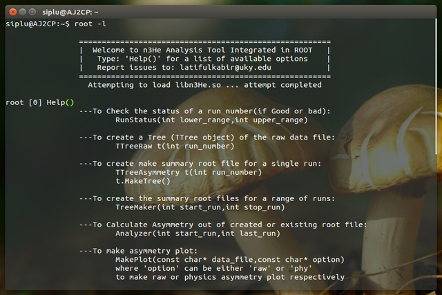

n3He Analysis Tools
=====================
n3He Analysis tool integrated in ROOT. Its an extension to ROOT with additional analysis functionality added required for the n3He experiment at Oak Ridge National Lab.

Instruction:
--------------
* Compile the make file inside libn3He directory.
* Before you try it you MUST do the following:
      1. Put the following command into your ~/.bashrc file:

           ```
	      if [ -f /path/to/libn3He/bin/thisn3He.sh ]; then

	      . /path/to/libn3He/bin/thisn3He.sh

	      fi
           ```

	  2. Now copy the rootlogon.C file in the directory 'macros' under ROOT installation directory.  
	  
* Now from a new terminal start root doing "root -l".
* For a list of available options Type "Help()"

 



